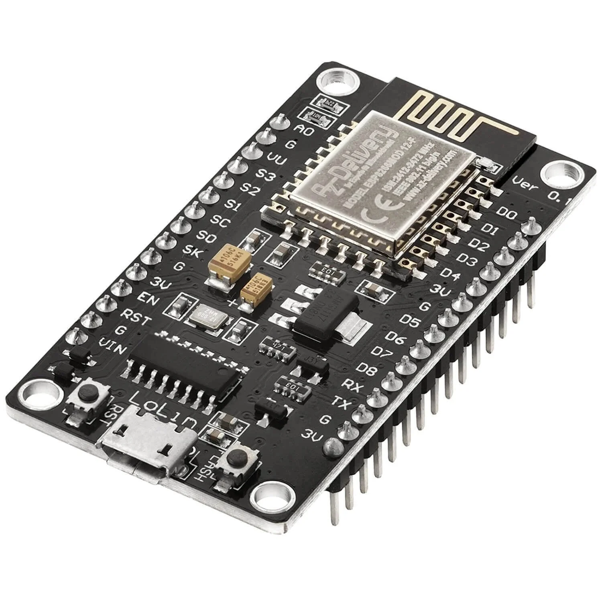
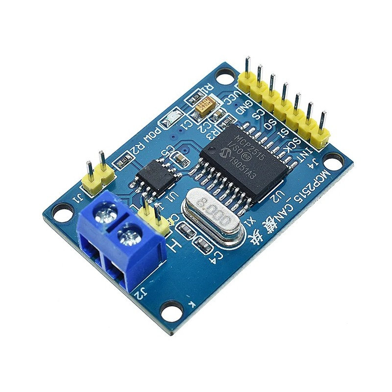
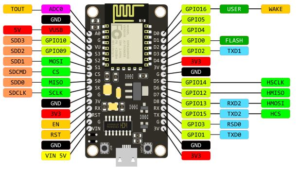

### Emerson / Vertiv R48 controller
This is a controller program designed to set various parameters (online and offline) of the Emerson or Vertiv R48 high performance rectifiers.

The code is entirely based on a [endless-sphere.com forum post](https://endless-sphere.com/sphere/threads/emerson-vertiv-r48-series-can-programming.114785/page-5) and was slightly modified to work on an ESP8266. It provides an API and beautiful web interface from where you can change various R48 parameters in runtime.

  

The R48 unit is accessible via the CAN bus. To use this project to control the R48, get one ESP8266 board like a Wemos D1 m1n1 or a Lolin NodeMCU v3 and a MCP2515 board. These are readily available on a known chinese online shop.

   

Connect the ESP8266 board to the MCP2515 board using the following pins. You can change them in the code if you want.

MCP2515 Pin | ESP8266 Pin      | ESP8266 GPIO
------------|------------------|----------------
MOSI        | D7               | GPIO13
MISO        | D6               | GPIO12
SCK         | D5               | GPIO14
CS          | D8               | GPIO15 (Flexible, can be any available GPIO)
INT         | D1               | GPIO04 (Flexible, can be any available GPIO)

Here's a reference pinout of the Lolin NodeMCU v3 board.

  

### Building the project
The simplest way is to install **Platform IO**, which will load the project and take care of all the dependencies.

You can also use the **Arduino IDE** and install these dependencies manually:
* expressif 8266 core 4.2.1
* mcp_can 1.5.1
* ESP32Async/ESPAsyncTCP 2.0.0
* ESP32Async/ESPAsyncWebServer 3.8.1

### References
* The [endless-sphere.com forum post](https://endless-sphere.com/sphere/threads/emerson-vertiv-r48-series-can-programming.114785/page-5)
* ESPHome [Emerson Vertiv R48 Component](https://github.com/leodesigner/esphome-emerson-vertiv-r48/)